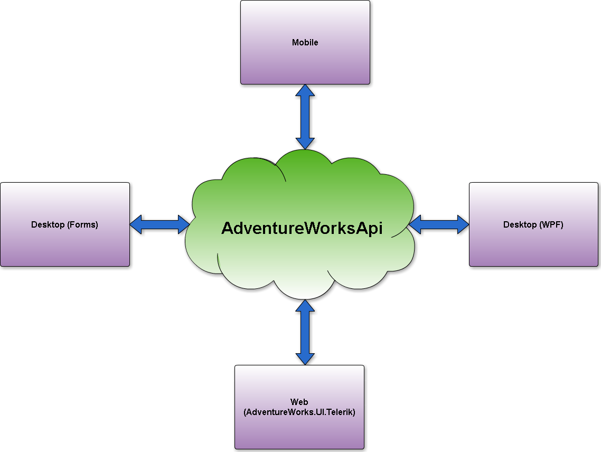
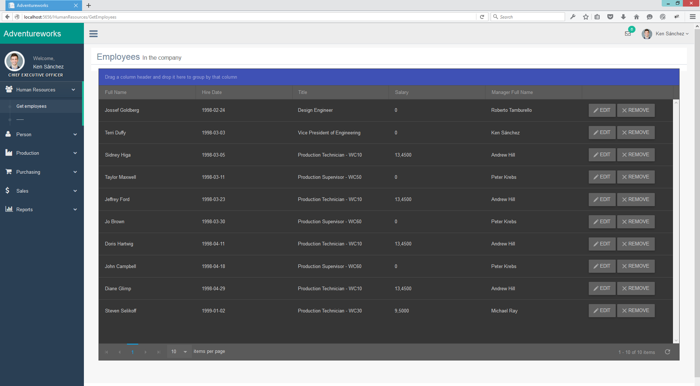

# AdventureWorks.UI.Telerik
GUI layer for ***AdventureWorksAPI***.  It' s meets the following guidelines:

 - Generic code/UI
 - Flexible UI
 - RWD
 - Call generic repositorys

<i class="icon-list"> Goals
------------------------------
**Must have**
 1. Fulfill all guidelines
 2. Use Telerik components

<i class="icon-book"> Planning
------------------------------

This project has a scheduled four main *GUI* types for the *API* project. The first project that will be completed is the Web *GUI* type. Based on the project there will be created other variations of the *GUI* project.

<i class="icon-sitemap"> Results
------------------------------
- **Web**

- **Desktop (Forms)**
- **Desktop (WPF)**
- **Mobile**
